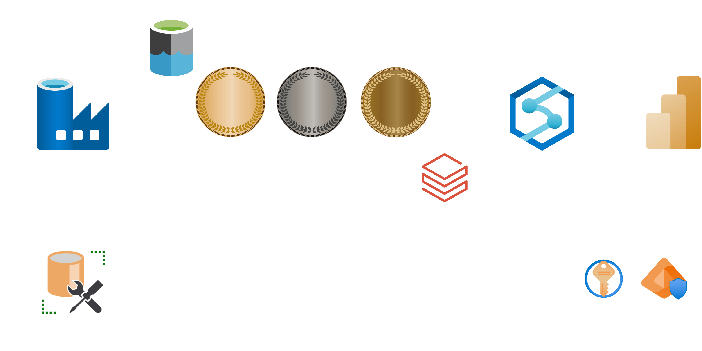
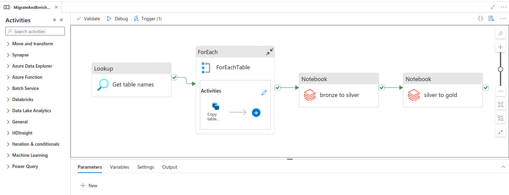
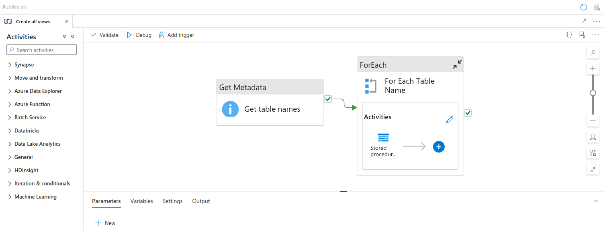
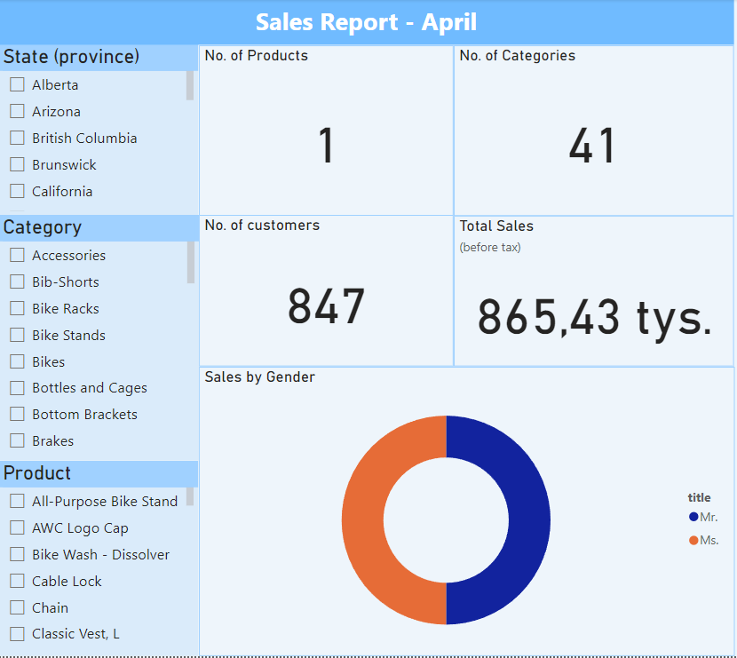

# ETL Project: Migrating On-Prem SQL Database to Azure Cloud

## Project Overview

This project aims to migrate an on-premises SQL database to the Azure Cloud, leveraging a range of Azure services and ETL concepts to ensure a smooth and efficient transition. The solution incorporates a multi-hop lakehouse architecture, emphasizing security, governance, and data quality.

I used [AdventureWorks sample databases](https://learn.microsoft.com/en-us/sql/samples/adventureworks-install-configure?view=sql-server-ver16&tabs=ssms) from Microsoft.

## Technologies Used

- **OnPrem SQL Server** with SQL Server Management Studio (SSMS)
- **Azure Data Lake Gen2**
- **Azure Data Factory (ADF)**
- **Databricks**
- **Azure Synapse Analytics**
- **Serverless SQL Database**
- **Power BI**
- **Azure Key Vault**
- **Azure Resource Groups**

## Architecture 

The architecture for this project follows the bronze-silver-gold (multi-hop) lakehouse model:
1. **Bronze Layer**: Raw data ingested into Azure Data Lake Gen2. (Exactly the same as in the On-Prem DB)
2. **Silver Layer**: Casted all columns with "date" in name to *datetime* type
3. **Gold Layer**: Changed column names from *CamelCase* to *snake_case*.

## ADF (Azure Data Factory) Pipeline

The pipeline consists of the following main tasks:
1. **Lookup**: Gets names of all tables within the On-Prem SQL Database
2. **ForEach**: *Selects all* from each table, and copies data into a bronze layer
3. **Notebooks**: Performs modifications on data and writes data to Azure Data Lake

## Synapse Analytics Pipeline

The pipeline consists of the following main tasks:

1. **Get Metadata**: Retrieves metadata from the Azure Data Lake container to list child items.
2. **For Each**: Iterates through the listed items and executes a stored procedure to create or alter Serverless SQL views for Delta tables.

## Power BI Report

## Concepts Implemented

- **Multi-Hop Architecture**: Bronze-Silver-Gold layers for data processing and storage.
- **Security and Governance**: Managed through Azure Key Vault and secure access controls.
- **Quality Checks**: Incorporated to ensure data integrity and accuracy throughout the ETL process.

## Setup and Configuration

1. **Azure Resources**:
   - Ensure all necessary Azure resources (Data Lake, Data Factory, Databricks, Synapse Analytics, etc.) are provisioned and configured.
   
2. **Configuration Files**:
   - Update configuration files with your Azure environment details and credentials.

3. **Deployment**:
   - Deploy the ETL pipeline in Azure Data Factory.
   - Set up Databricks notebooks and jobs.
   - Configure Serverless SQL views (using Synapse Analytics) and Power BI reports.

## Usage

1. **Run ETL Pipeline**: Trigger the pipeline in Azure Data Factory to start the data migration process.
2. **Monitor**: Use ADF monitoring tools to track the progress and troubleshoot any issues.
3. **Reporting**: Access reports and dashboards in Power BI for data analysis.

## Security and Governance

- **Data Encryption**: All data is encrypted in transit and at rest.
- **Access Controls**: Access to resources is managed using Azure Role-Based Access Control (RBAC) and Key Vault secrets.

## Quality Assurance

- **Data Validation**: Perform regular data validation checks to ensure data quality.
- **Error Handling**: Implement error handling and logging mechanisms to track and resolve issues.

## Contact

For any questions or inquiries, please contact me at bernasiakk@gmail.com